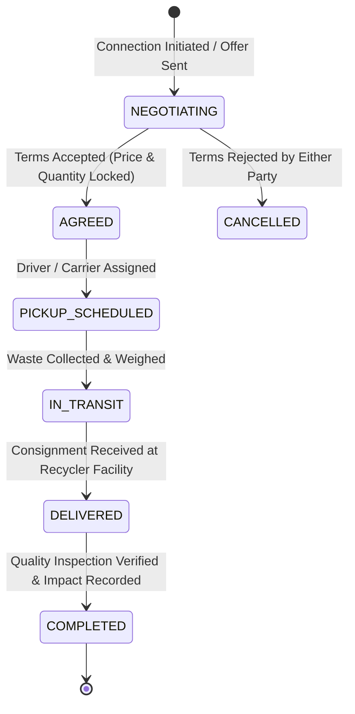

# CIRCULON – AI-Powered Circular Waste Marketplace

CIRCULON is an enterprise-grade circular economy platform that transforms industrial, commercial, and agricultural byproduct streams into high-value secondary raw materials. Powered by Google Gemini 3.6 Flash generative AI, multi-criteria compatibility algorithms, real-time negotiation workflows, and automated fleet logistics, CIRCULON bridges the gap between waste generators and industrial recyclers/procurement buyers.

---

## 🌟 Executive Summary & Key Highlights

- **Multi-Role Circular Marketplace:** Purpose-built workflows for **Waste Generators (Sellers)**, **Industrial Recyclers (Buyers)**, **Fleet Logistics (Drivers)**, and **Platform Administrators**.
- **Gemini 3.6 Flash AI Waste Characterization:** Instant computer-vision and NLP waste analysis classifying industrial materials, estimating contamination risk, predicting circular market value, and suggesting upcycling applications.
- **Resilient AI Circular Fallback Knowledge Base:** High-precision fallback engine containing industrial recycling parameters (HDPE, PET, Post-Industrial Cotton, Bagasse, Rice Husk, Coir, Paper, Scrap Metal) ensuring 100% operational uptime.
- **6-Point Compatibility Matching Engine:** Computes an objective compatibility score (0–100%) broken down into Material Type, Volume/Quantity, Geographic Proximity, Quality/Purity, Price Feasibility, and Circular Industry Fit—accompanied by transparent disclaimers.
- **Commercial Negotiation & Deal Pipeline:** End-to-end deal lifecycle (`NEGOTIATING` ➔ `AGREED` ➔ `PICKUP_SCHEDULED` ➔ `IN_TRANSIT` ➔ `DELIVERED` ➔ `COMPLETED`), with direct messaging, counter-offers, and transport dispatch.
- **Fleet Logistics & Real-Time Geolocation:** Driver dispatch tracking with live coordinates, route progression, and delivery verification.
- **ISO 14040/14044-Aligned Environmental Impact (LCA):** Quantifies verified landfill diversion, CO2e greenhouse gas reduction, methane avoidance, water conservation, and tree-year sequestration equivalents.
- **Enterprise Governance & Moderation:** Complete Admin Control Center with company verification audits, listing moderation (Approve / Reject / Suspend), user account suspension/activation, and incident reports.

---

## 🏗️ Architecture & Technology Stack

| Layer | Technology | Description |
|---|---|---|
| **Framework** | Next.js 16 (App Router) | React Server Components, Server Actions, Dynamic Layouts |
| **UI & Styling** | React 19, Tailwind CSS, Lucide React | Modern industrial dashboard design with custom palette (`green-700/800`, `emerald`, `gray-950`) |
| **Artificial Intelligence** | Google Gemini 3.6 Flash (`@google/genai`) | Multi-modal image analysis, natural language recycling finder, characterization |
| **Database & Auth** | Supabase (PostgreSQL) + Auth | Row Level Security (RLS), session management, fallback in-memory synchronization |
| **Maps & Tracking** | Custom Leaflet / OpenStreetMap | Real-time vehicle simulation, coordinate calculation, delivery tracing |
| **Type Safety** | TypeScript 5+ | Strict typing across domain models, server actions, and API payloads |

---

## 👥 Primary User Roles & End-to-End Workflows

### 1. Waste Generator / Seller (`/dashboard`, `/waste`, `/waste/add`, `/matches`)
- **Add Waste with AI Characterization:**
  - Submit detailed industrial specifications: Material Name, Category, Industry Source, Quantity, Unit (kg, tons, m³), Moisture %, Contamination Level (None, Low, Medium, High), Expected Price per Unit, Pickup Readiness Date, and City/State.
  - Upload physical byproduct images for AI visual analysis.
  - Gemini evaluates purity, contaminants, degradation state, and circular market value.
- **Listings Management:**
  - Filter listings by status: `All`, `Active`, `Pending`, `Matched`, `Sold/Completed`, `Rejected`.
  - In-place detail modal and specifications editing modal.
  - Launch buyer compatibility matching directly from any listing card.
- **Multi-Criteria Buyer Matching:**
  - View matched industrial buyers ranked by overall compatibility.
  - Inspect detailed 6-point compatibility score breakdown bars (Material, Quantity, Proximity, Quality, Price, Industry).
  - Clear non-guarantee disclaimer advising verification before contractual commitment.
  - One-click **"Start Deal Negotiation"** to initiate formal transaction terms.
- **Deals & Commercial Negotiation:**
  - Review incoming inquiries and counteroffers on the dedicated Deals dashboard.
  - Accept, decline, or renegotiate terms with buyers in real-time.
  - Monitor fleet dispatch and delivery confirmation.

---

### 2. Recycler / Material Buyer (`/buyer`)
- **Procurement Command Center:**
  - Unified multi-tab dashboard: `Overview`, `Requirements`, `Marketplace`, `AI Match Finder`, `Deals`, `Saved`, and `Fleet Tracking`.
- **Material Specifications Management:**
  - Create and configure precise procurement profiles (Target Material, Preferred Form, Max Contamination Allowed %, Min Purity %, Monthly Target Volume, Target Price Range, and Delivery Radius).
- **Secondary Raw Material Marketplace:**
  - Multi-attribute search and filtering across Category, Industry, Maximum Contamination, and Sort criteria (Newest, Price, Quantity).
  - Save/bookmark listings for future procurement rounds.
  - Initiate negotiations directly with sellers from any listing card.
- **Natural Language AI Match Finder:**
  - Input procurement queries in natural plain English (e.g., *"Looking for 10 tons of clean post-industrial HDPE flakes with under 2% moisture within 150km of Chennai"*).
  - Gemini 3.6 Flash parses specifications and scores available marketplace listings semantically.
- **Inbound Deals & Delivery Tracking:**
  - Track active negotiations, agreed pricing, and dispatched freight.
  - Live driver location tracking on an interactive delivery map.

---

### 3. Platform Administrator (`/admin`)
- **Global Circular Metrics:** Real-time Gross Marketplace Volume (GMV), Total Diverted Waste, Net CO2e Avoidance, and Active Transport Dispatches.
- **User Management & Moderation:**
  - Comprehensive user directory with filtering by role (`generator`, `recycler`, `admin`, `driver`) and account status.
  - Instant one-click **Suspend Account** and **Activate Account** controls with visual badge status.
- **Company Verification & KYB:**
  - Verification queue for onboarded commercial entities.
  - Integrated document previewer (supports PDFs, images, license certificates).
  - One-click **Approve** and **Reject** actions with automated audit notification email dispatch.
- **Waste Listing Moderation Queue:**
  - Inspect seller submissions for regulatory compliance, hazardous material restrictions, and accurate classification.
  - Actions: **Approve Listing**, **Reject Listing**, or **Suspend Listing**.
- **AI & Marketplace Analytics:**
  - AI classification accuracy benchmarks (~94.8% accuracy rate).
  - Material distribution breakdown (Plastics, Agricultural, Textiles, Metals, Paper).
  - Active circular industries analysis and average deal negotiation turnaround time.
- **Environmental Impact Assessment (LCA):**
  - Calculations aligned with ISO 14040/14044 Life Cycle Assessment principles.
  - Metrics: Greenhouse gas reduction, landfill volume conserved, industrial water saved, and equivalent mature trees planted.
- **Platform Safety & Incident Reports:**
  - Compliance incident triage, contamination dispute management, and resolution tracking.

---

### 4. Fleet Logistics / Transport Driver (`/tracking`)
- **Transport Assignment & Dispatch:**
  - View assigned commercial waste collections and delivery routes.
  - Step-by-step dispatch workflow: `PICKUP_SCHEDULED` ➔ `IN_TRANSIT` ➔ `DELIVERED`.
  - Automated GPS coordinate simulation and route progress updates.

---

## 🧮 Compatibility Matching Algorithm (6-Point Metric)

CIRCULON calculates match compatibility using a transparent weighted multi-factor formula:

$$\text{Compatibility Score} = \sum_{i=1}^{6} w_i \times S_i$$

1. **Material Type Match ($w = 25\%$):** Exact category and sub-grade correspondence.
2. **Quantity / Volume Fit ($w = 20\%$):** Listing volume vs. buyer min/max lot thresholds.
3. **Geographic Proximity ($w = 15\%$):** Haulage distance calculated via Great-Circle distance; scores decrease beyond maximum delivery radius.
4. **Quality & Contamination Tolerance ($w = 15\%$):** Purity and moisture levels compared against buyer technical tolerance limits.
5. **Price Compatibility ($w = 15\%$):** Seller asking price compared against buyer target budget ceiling.
6. **Circular Industry Fit ($w = 10\%$):** Target industry synergy (e.g., Agricultural biomass to Bio-energy vs. Packaging).

> **Regulatory & Compliance Notice:** Compatibility scores are algorithmic recommendations based on user-provided parameters and AI estimations. CIRCULON strongly advises independent physical material testing, batch sampling, and contractual due diligence prior to dispatch.

---

## 🔄 Commercial Deal Lifecycle



---

## 🗄️ Database Architecture & Fallback Resilience

The platform connects to Supabase PostgreSQL, backed by a resilient server-side fallback store that guarantees zero downtime and smooth demo execution even prior to remote schema migrations:

### Core Tables
- `profiles`: User identity, role (`generator` | `recycler` | `admin` | `driver`), company name, contact, account status (`active` | `suspended`).
- `waste_listings`: Waste material specifications, moisture %, contamination, expected price, photos, AI analysis JSON, and listing status (`active` | `pending` | `matched` | `sold` | `rejected` | `suspended`).
- `verification_requests`: KYB documentation, company registration number, document URLs, verification status, and audit notes.
- `buyer_requirements`: Detailed procurement specifications, target materials, acceptable contamination limits, price targets, and fulfillment tracking.
- `deals`: Commercial transactions, agreed pricing, quantity, delivery milestones, logistics status, and carbon impact.
- `deal_messages`: Negotiation message threads, counteroffers, and audit log.
- `saved_listings`: Recycler bookmarked inventory for active procurement pipelines.
- `reports`: Platform safety, contamination discrepancy, and dispute reporting.

---

## 🔑 Demo & Test Credentials

The application is pre-seeded with authenticated test accounts for instant evaluation across all roles:

| Role | Email Address | Password | Purpose |
|---|---|---|---|
| **Platform Administrator** | `admin@circulon.com` | `Admin@123456` | Moderation, KYB audits, analytics, user suspension |
| **Waste Generator (Seller)** | `seller@circulon.com` | `Seller@123456` | Listing waste, AI analysis, 6-point buyer matching, deals |
| **Industrial Recycler (Buyer)**| `buyer@circulon.com` | `Buyer@123456` | Marketplace procurement, AI match finder, negotiation |
| **Logistics Driver** | `driver@circulon.com` | `Driver@123456` | Route dispatch, transit tracking, delivery milestones |

---

## ⚙️ Environment Variables & Setup Guide

### 1. Prerequisites
- **Node.js**: v18.18.0 or newer (tested on Node v20 / v24)
- **Package Manager**: `npm`, `yarn`, or `pnpm`

### 2. Configure Environment Variables
Create a `.env.local` file in the project root:

```bash
# Supabase Configuration
NEXT_PUBLIC_SUPABASE_URL=https://your-project.supabase.co
NEXT_PUBLIC_SUPABASE_ANON_KEY=your_supabase_anon_key

# Google Gemini Generative AI API Key
GOOGLE_GENERATIVE_AI_API_KEY=your_gemini_api_key
# Alternatively:
GEMINI_API_KEY=your_gemini_api_key
```

### 3. Installation & Local Development

```bash
# Clone the repository
git clone https://github.com/offxranjith12-tech/CIRCULON.git
cd CIRCULON

# Install dependencies
npm install

# Launch development server
npm run dev
```

Navigate to `http://localhost:3000` in your web browser.

### 4. Production Build

```bash
npm run build
npm run start
```

---

## 🛡️ Security & Environmental Standards

- **Zero Secret Exposure:** Client-side environment variables are strictly limited to public keys (`NEXT_PUBLIC_`). Server Actions isolate privileged API keys.
- **ISO 14040/14044 Compliance:** Environmental accounting adheres to internationally recognized Life Cycle Assessment frameworks for cradle-to-gate byproduct valorization.
- **KYB & Material Quality Controls:** Enforces company document verification and two-way deal sign-off before logistics dispatch.

---

## 📄 License

This project is licensed under the MIT License — see the [LICENSE](LICENSE) file for details.
